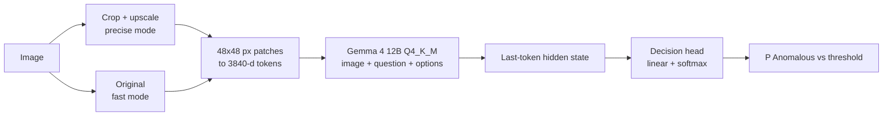

# jev-anomaly

Image anomaly detection based on Jev-Omni (Q4_K_M GGUF, llama.cpp, single local GPU).

[](https://huggingface.co/Reza2kn/Jev-Omni-Q4_K_M-GGUF)
[](https://github.com/ggml-org/llama.cpp)
[](https://www.gradio.app/)
[](LICENSE)


## Overview

- Model: [Jev-Omni](https://huggingface.co/akhilaaa3/Jev-Omni), Gemma 4 12B based multimodal decision classifier
- Input: image + state + question + options `[Normal, Anomalous]`
- Output: per-option probability, `P(Anomalous)` used as anomaly score
- No training or fine-tuning, prompt and input preprocessing only
- Evaluated on MVTec AD (bottle, screw, carpet)
- Gradio UI for single-image inspection

## Requirements

- NVIDIA GPU, 12 GB VRAM (about 10.5 GB used)
- Linux, CUDA toolkit, cmake, git, Python 3.10+
- About 15 GB disk
- Tested: RTX 4070 Ti 12GB, Ubuntu 26.04, CUDA 13.3, Python 3.14

## Quick start

```bash
git clone https://github.com/ingon1026/jev-anomaly.git && cd jev-anomaly
./setup.sh        # venv, llama.cpp CUDA build, model download (7 GB), SHA-256 check
./get_mvtec.sh    # optional: MVTec AD samples for the app and eval scripts
./run.sh          # llama-server + app, http://127.0.0.1:7860
```

| Access | Command |
|---|---|
| Local only (default) | `./run.sh` |
| LAN | `./run.sh --lan [--auth user:pass]` |
| Temporary public link (72 h) | `./run.sh --share --auth user:pass` |

- llama-server always binds to `127.0.0.1` (embedding endpoint exposes internal states)
- Only the Gradio UI is exposed

## App

- Presets: bottle, screw, carpet, custom
- Precise mode: crop object region, upscale to 1584 px (up to 1,089 image tokens), ~0.8 s/image
- Fast mode: original image, ~0.4 s/image
- State, question and threshold are editable
- Preset thresholds are tuned on MVTec dev split, recalibrate for real line images

## Results

MVTec AD test split, split into dev / holdout halves. Prompts and thresholds chosen on dev, AUROC reported on holdout.

| Method | screw | bottle | s/image |
|---|---:|---:|---:|
| Base question | 0.901 | 0.965 | 0.35 |
| Defect types in question | 0.956 | 0.935 | 0.38 |
| Object crop + upscale + defect types (precise mode) | 0.981 | 0.945 | 0.76 |
| 2x2 tiles, max score | 0.909 | 0.942 | 2.0 |
| Option order swap, averaged | 0.959 | 0.926 | 0.75 |
| Multi-option (defect type) | 0.814 | 0.894 | 0.4 |
| Hidden state + logistic regression | 0.956 | 0.926 | - |
| Hidden state kNN, normal only | 0.816 | 0.871 | - |

- carpet, base question: AUROC 1.000
- bottle: only 10 normal images per half, differences between methods are within noise
- Multi-option defect type accuracy: 25% (screw), 48% (bottle)
- Probabilities are not calibrated, threshold must be set per product
- Hardware: RTX 4070 Ti, llama.cpp `0bc845d3`, vision projector on CPU, LLM on GPU

Details: [docs/REPORT.md](docs/REPORT.md) (Korean)

## How it works



- Vision projector has no transformer blocks, patches are linearly projected into the LLM
- Decision head sees option index only, keep option order `[Normal, Anomalous]`
- One token covers 48 px, small defects hit only a few tokens, upscaling helps

| Screw head scratch | Bottle contamination |
|---|---|
|  |  |
| 4-6 of 441 tokens. Base 0.15 (miss), precise 0.99 (hit) | 15% of area but low contrast. Base 0.31 (miss) |

Grid = 48 px image token, red = MVTec defect mask.

## Files

| File | Description |
|---|---|
| `app.py` | Gradio UI |
| `setup.sh`, `run.sh` | Setup, run server + app |
| `get_mvtec.sh` | MVTec AD download (bottle, screw, carpet) |
| `eval_anomaly.py` | Folder eval: CSV, AUROC, F1, top misses |
| `stage12.py`, `stage2.py` | Improvement experiments |
| `conveyor_demo.py` | Synthetic conveyor demo video |
| `docs/REPORT.md`, `docs/NOTES.md` | Report and progress notes (Korean) |

## Known issues

- Vision projector on CUDA returns NaN (llama.cpp `6e60f356`, `0bc845d3`). After one NaN every result is NaN until restart. `run.sh` uses `--no-mmproj-offload`, scripts stop on NaN.
- Q4 probabilities differ from the FP32 source model.
- Thresholds from MVTec do not transfer to other data.

## Acknowledgments

[Jev-Omni](https://huggingface.co/akhilaaa3/Jev-Omni) · [Jev-Omni Q4_K_M GGUF](https://huggingface.co/Reza2kn/Jev-Omni-Q4_K_M-GGUF) · [Gemma 4](https://huggingface.co/google/gemma-4-12B-it) · [llama.cpp](https://github.com/ggml-org/llama.cpp) · [Gradio](https://www.gradio.app/) · [MVTec AD](https://www.mvtec.com/company/research/datasets/mvtec-ad)

## License

- Code: MIT, see [LICENSE](LICENSE)
- Model: Apache-2.0, Gemma 4 terms apply
- MVTec AD derived images in `docs/images/`: CC BY-NC-SA 4.0. Dataset not included.
