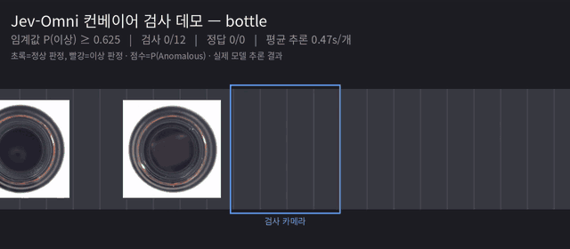
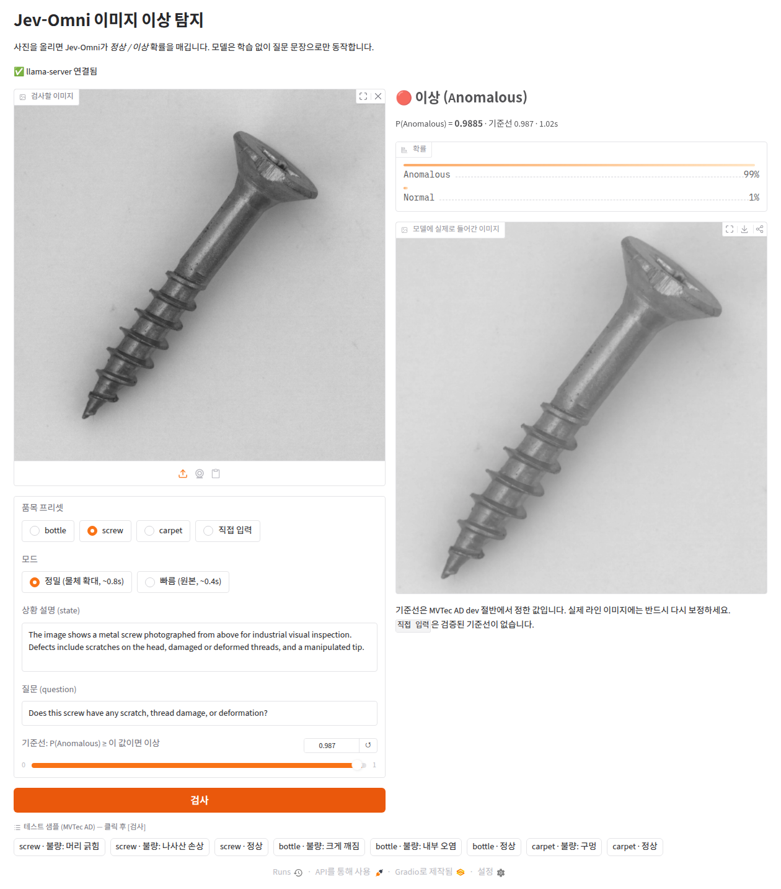
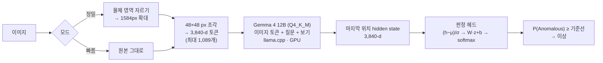
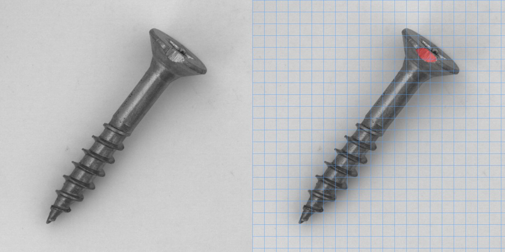
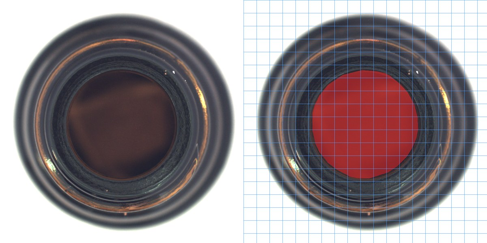

<div align="center">

# jev-anomaly

**학습 없이, 질문 한 줄로 하는 이미지 이상 탐지 — Jev-Omni 12B를 로컬 GPU 한 장에서.**

*Ask "is this defective?" — get a calibrated-ish probability, not a sentence. No training, no fine-tuning.*

[](https://huggingface.co/Reza2kn/Jev-Omni-Q4_K_M-GGUF)
[](https://huggingface.co/google/gemma-4-12B-it)
[](https://github.com/ggml-org/llama.cpp)
[](https://www.gradio.app/)
[](requirements.txt)
[](#요구-사항)
[](LICENSE)

</div>

<table>
<tr>
<td width="50%"></td>
<td width="50%"></td>
</tr>
</table>

<sub>**왼쪽** 합성 컨베이어 데모 — 물건이 검사 카메라를 지날 때마다 실제 모델을 한 번씩 호출해 판정(초록 정상 / 빨강 이상)하고 정답과 맞았는지 표시. 기본 질문·빠름 모드, 2배속. 병 속 오염을 정상으로 놓치는 장면도 그대로 담았습니다. **오른쪽** Gradio 앱 — 나사 머리 잔긁힘을 정밀 모드(물체 확대)로 `P(Anomalous) = 0.9885`, 이상 판정.</sub>

## 무엇을 하나

[Jev-Omni](https://huggingface.co/akhilaaa3/Jev-Omni)는 챗봇이 아니라 **선택지에 확률을 매기는 분류기**입니다. 사진과 함께 *"이 나사에 긁힘, 나사산 손상, 변형이 있어? ① Normal ② Anomalous"* 라고 물으면 문장 대신 보기별 확률을 돌려줍니다. 이 레포는 그 확률을 이상 점수로 써서

- 로컬 GPU(12GB)에서 모델을 띄우고 — `llama.cpp` + 4bit GGUF
- MVTec AD로 성능을 재고 — AUROC / F1 / 오판 사례
- 학습 없이 끌어올릴 수 있는 만큼 끌어올리고 — 질문 구체화, 물체 확대
- 웹 UI로 쓰게 합니다 — Gradio, 사내망 / 임시 공개 링크

## Quick start

```bash
git clone https://github.com/ingon1026/jev-anomaly.git && cd jev-anomaly
./setup.sh               # venv · llama.cpp CUDA 빌드 · 모델 7GB 다운로드 · SHA-256 검증 (~10분)
./get_mvtec.sh           # (선택) MVTec AD 샘플 — 앱의 테스트 샘플 버튼과 평가 스크립트용
./run.sh                 # llama-server + 앱 → http://127.0.0.1:7860
```

| 공유 범위 | 명령 |
|---|---|
| 내 PC만 (기본) | `./run.sh` |
| 같은 네트워크 | `./run.sh --lan` → `http://<PC IP>:7860` (필요하면 `--auth user:pass`) |
| 임시 공개 링크 (72시간) | `./run.sh --share --auth user:pass` — 비밀번호 필수 |

llama-server는 어떤 경우에도 `127.0.0.1`에만 바인딩됩니다(임베딩 엔드포인트가 모델 내부 상태를 노출). 외부로 열리는 것은 Gradio UI뿐입니다.

## Measured

MVTec AD test split을 dev / holdout 절반으로 나눠 **프롬프트·기준선은 dev에서만 고르고 holdout으로 보고**했습니다.

| 방식 (holdout AUROC) | screw | bottle | 장당 시간 |
|---|---:|---:|---:|
| 기본 질문 *"정상이야, 결함 있어?"* | 0.901 | **0.965** | 0.35 s |
| 결함 종류 명시 *"긁힘, 나사산 손상, 변형 있어?"* | 0.956 | 0.935 | 0.38 s |
| **물체 영역 확대 + 결함 종류 명시** (앱 정밀 모드) | **0.981** | 0.945 | 0.76 s |
| 2×2 타일 최댓값 | 0.909 | 0.942 | 2.0 s |
| 보기 순서 바꿔 평균 | 0.959 | 0.926 | 0.75 s |
| 다지선다로 결함 종류까지 | 0.814 | 0.894 | 0.4 s |
| hidden state + 로지스틱 회귀 | 0.956 | 0.926 | +0 |
| 정상만으로 kNN | 0.816 | 0.871 | +0 |

- carpet(학습 없이 기본 질문): AUROC **1.000**, 임계값 0.5에서 117장 전부 정답
- **bottle은 방식 간 차이가 오차 범위 안** — holdout 정상 10장뿐이라 기본 질문의 dev/holdout 차이(0.86 vs 0.97)가 방식 간 차이만큼 큼
- 다지선다로 결함 **종류**를 맞히는 건 실패(정답률 25% / 48%)
- 확률은 보정돼 있지 않음 — 질문을 구체화하면 점수가 0.95~0.99로 몰림 → **품목별 기준선 보정 필수**
- 속도: RTX 4070 Ti, llama.cpp `0bc845d3`, 비전 단계 CPU / LLM GPU. VRAM 약 10.5GB

전체 표·오판 사례·편향 발견 기록은 [`docs/REPORT.md`](docs/REPORT.md).

## How it works



- **별도 비전 인코더가 없음** — Gemma 4 "Unified"의 프로젝터(`mmproj`)는 변환 층이 0개. 픽셀 조각을 선형 변환만 해서 12B 본체에 넣고, 보는 일 자체를 LLM이 합니다.
- **판정 헤드는 보기 텍스트를 읽지 않고 번호만 앎** — 본체가 프롬프트의 보기를 읽고 "정답은 2번 쪽"을 hidden state에 새기고, 3.8MB 선형층이 그걸 확률로 바꿉니다. 그래서 보기 순서 `[Normal, Anomalous]`는 고정.
- **왜 확대가 먹히나** — 토큰 하나가 48px이라 작은 결함은 수백 개 중 몇 개에만 걸립니다.

<table>
<tr>
<td width="50%"></td>
<td width="50%"></td>
</tr>
</table>

<sub>파란 격자 한 칸 = 이미지 토큰 1개(48px), 빨강 = MVTec 불량 마스크. **왼쪽** 나사 머리 잔긁힘 — 441칸 중 4~6칸. 기본 질문으로는 0.15로 놓치고, 물체 확대 후에는 0.99로 잡습니다. **오른쪽** 병 속 오염 — 면적은 15%로 크지만 바닥이 살짝 탁해진 정도라 대비가 약해서 놓칩니다(0.31).</sub>

## 요구 사항

| 항목 | 최소 | 확인한 환경 |
|---|---|---|
| GPU | NVIDIA, VRAM 12GB | RTX 4070 Ti 12GB, Driver 595 |
| OS | Linux + CUDA 툴킷, cmake, git | Ubuntu 26.04, CUDA 13.3 |
| Python | 3.10+ | 3.14 |
| 디스크 | 약 15GB | |

## 레포 구성

| 파일 | 역할 |
|---|---|
| `app.py` | Gradio UI — 프리셋(bottle / screw / carpet / 직접 입력), 정밀·빠름 모드, 기준선 슬라이더 |
| `setup.sh` · `run.sh` | 설치 / 서버 + 앱 실행 |
| `eval_anomaly.py` | 폴더 단위 평가 — CSV, AUROC, F1, 오판 상위 5개 |
| `stage12.py` · `stage2.py` | 개선 실험 — 질문·확대·타일·순서·다지선다 / hidden state 분류기 |
| `conveyor_demo.py` | 합성 컨베이어 데모 영상 생성 |
| `docs/REPORT.md` | 전체 결과, 한계, 권고 |
| `docs/NOTES.md` | 진행 기록 (환경, 이슈, 해결 과정) |

## 알려진 이슈

- **비전 프로젝터를 CUDA로 돌리면 NaN** — llama.cpp `6e60f356`, `0bc845d3` 모두 재현. 한 번 NaN이 나면 서버 재시작 전까지 모든 판정이 오염됩니다. `run.sh`는 `--no-mmproj-offload`로 이 단계만 CPU에서 돌리고, 스크립트는 NaN을 감지하면 즉시 멈춥니다.
- **4bit 양자화 확률 ≠ 원본 FP32** — 원본 모델 카드의 보정 수치(ECE 0.04)를 그대로 믿지 말 것.
- **MVTec 기준선은 MVTec 전용** — 실제 라인 이미지로 다시 보정해야 합니다.

## Acknowledgments

[Jev-Omni](https://huggingface.co/akhilaaa3/Jev-Omni) (Apache-2.0) · [Q4_K_M GGUF](https://huggingface.co/Reza2kn/Jev-Omni-Q4_K_M-GGUF) · [Gemma 4](https://huggingface.co/google/gemma-4-12B-it) · [llama.cpp](https://github.com/ggml-org/llama.cpp) · [Gradio](https://www.gradio.app/) · [MVTec AD](https://www.mvtec.com/company/research/datasets/mvtec-ad) (Bergmann et al., CVPR 2019)

## License

MIT — see [LICENSE](LICENSE). 모델은 Apache-2.0이며 Gemma 4 약관을 따릅니다. `docs/images/`의 MVTec AD 파생 이미지는 **CC BY-NC-SA 4.0**(비상업)이고, 데이터셋 자체는 레포에 포함하지 않습니다.
